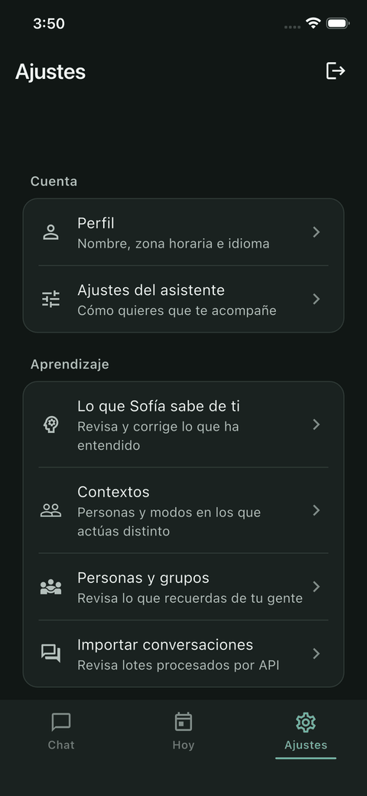
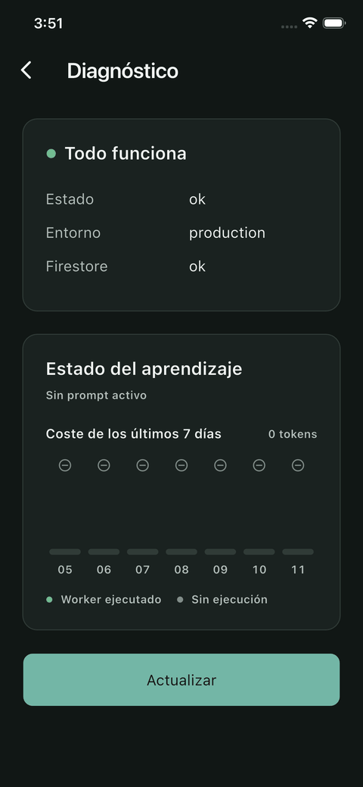
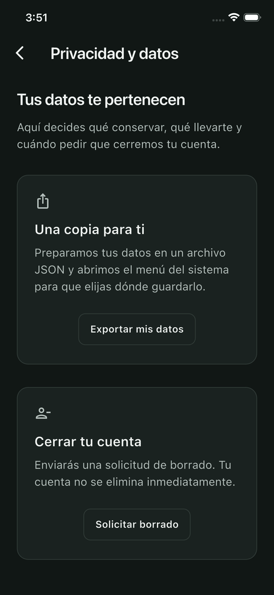
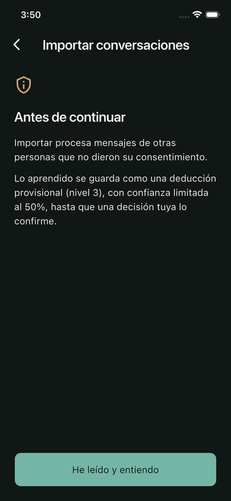

# Sofía

**Un asistente personal que aprende de tus decisiones hasta poder tomarlas por ti.**

Sofía no es un chatbot con memoria. Es un sistema que observa cada decisión que tomas
sobre lo que te propone —la apruebas, la corriges, la rechazas— destila esas decisiones en
creencias sobre ti, y usa esas creencias para decidir cuándo puede actuar sin preguntar.

El objetivo declarado del proyecto es la **simbiosis**: que el asistente llegue a conocer
al usuario lo bastante como para hacer cosas por él sin pedirle permiso cada vez, sin que
eso se sienta invasivo ni impredecible.

<p align="center">
  
  
  
  
  
</p>
<p align="center">
  <sub>Chat &nbsp;·&nbsp; Ajustes &nbsp;·&nbsp; Diagnóstico &nbsp;·&nbsp; Privacidad &nbsp;·&nbsp; Importar conversaciones</sub>
</p>

---

## Índice

- [Qué hace hoy](#qué-hace-hoy)
- [Arquitectura](#arquitectura)
- [El bucle de aprendizaje](#el-bucle-de-aprendizaje)
- [El modelo de datos](#el-modelo-de-datos)
- [Gestión de contexto y tokens](#gestión-de-contexto-y-tokens)
- [Autonomía y seguridad](#autonomía-y-seguridad)
- [Privacidad](#privacidad)
- [Cómo levantarlo](#cómo-levantarlo)
- [Estado frente a la especificación original](#estado-frente-a-la-especificación-original)

---

## Qué hace hoy

| Capacidad | Estado |
|---|---|
| Conversación con propuestas de acción (crear actividad, recordatorio, memoria, reflexión) | ✅ |
| Confirmación en tres estados: aprobar, **corregir**, rechazar con motivo | ✅ |
| Destilación nocturna de decisiones en creencias sobre el usuario | ✅ |
| Prompt base recompilado a diario desde esas creencias | ✅ |
| Comportamiento distinto por persona y por modo (trabajo, descanso, pareja…) | ✅ |
| Motor de probabilidad que decide cuándo actuar sin preguntar | ✅ |
| El usuario puede ver, corregir y retirar lo que Sofía cree saber de él | ✅ |
| Recordatorios con entrega push (FCM) | ✅ |
| Importación de conversaciones externas como contexto de baja confianza | ✅ |
| Exportación y solicitud de borrado de datos | ✅ |

Fuera de alcance por ahora: voz, sensores de presencia, control de dispositivos del hogar
y UI dirigida por servidor. Ver [estado frente a la especificación](#estado-frente-a-la-especificación-original).

---

## Arquitectura

Monorepo con tres piezas y una frontera dura entre ellas.

```
Flutter (iOS · Android · macOS)
        │  HTTP + JWT
        ▼
Backend Go  ──────────────►  DeepSeek        (generación)
   │                         Vertex AI       (embeddings)
   │  Admin SDK
   ▼
Firestore
        ▲
        │  jobs programados
   ┌────┴─────┬──────────┐
recordatorios  síntesis   ingesta
```

**La app nunca habla con Firestore.** No incluye `cloud_firestore`: todo el acceso a datos
pasa por la API en Go. Eso concentra la autorización en un solo lugar y permite que las
reglas de Firestore sean un `deny-all` absoluto.

### Backend — Go 1.24

Clean Architecture con Domain-Driven Design. Un paquete por módulo, y dentro siempre las
mismas cuatro capas:

```
internal/<módulo>/
├── domain/           entidades, reglas de negocio, interfaces de repositorio
├── application/      casos de uso; depende de domain, nunca de infraestructura
├── infrastructure/   DOS implementaciones por repositorio:
│                       memory_*.go     (en memoria, la que usan los tests)
│                       firestore_*.go  (producción)
└── interfaces/http/  handlers, requests, responses
```

Módulos: `auth`, `users`, `activities`, `reminders`, `insights`, `memory`, `learning`,
`ingestion`, `notifications`, `tools`, `privacy`, `conversations`, `ai/runtime`,
`ai/actions`.

La doble implementación de cada repositorio no es ceremonia: es lo que permite que **los
35 paquetes de tests corran sin red ni emuladores**, en segundos.

### Frontend — Flutter

Clean Architecture por feature (`data` / `domain` / `presentation`), Cubit para estado,
`go_router` para navegación, `get_it` para inyección de dependencias.

### Persistencia — Firestore

19 colecciones, ~15 índices compuestos declarados en `firestore.indexes.json`. La base
está en modo bloqueado: ningún cliente puede leerla ni escribirla directamente.

---

## El bucle de aprendizaje

Es el corazón del sistema y lo que lo separa de un asistente con historial.

```
1. Sofía propone            → ai_action_proposals (status: proposed)
2. Tú decides               → approved_direct | approved_corrected | rejected
                              + qué campos corregiste + cuánto tardaste en decidir
3. De madrugada, síntesis   → lee SOLO decisiones, nunca conversaciones crudas
4. Contraste con lo previo  → refuerza / contradice / crea creencias
5. Recompila el prompt base → desde cero, con techo duro de 1000 tokens
6. Mañana Sofía sabe más    → y la probabilidad de acertar sube
```

### Por qué no lee las conversaciones

La regla más importante del worker de síntesis: **procesa decisiones, no diálogo**. Una
conversación de cuarenta turnos sobre qué cenar produce cero señal si no hubo una
propuesta; una sola corrección de horario produce señal fuerte.

Un resumen diario que leyera el chat crudo acumularía ruido, y ese ruido acabaría en el
prompt base contaminando todo lo que Sofía hace. La restricción está escrita como
instrucción explícita en el prompt de síntesis y verificada por tests.

### Síntesis, no acumulación

El prompt base **nunca se edita ni se le añade texto**. Cada noche se **recompila desde
cero** a partir de las creencias vigentes, ordenadas por valor:

```go
valor = confianzaDecaída × log1p(evidencia) / (1 + contradicciones)
```

Se llenan 1000 tokens y lo que no cabe no se pierde: pasa a `situational` y se recupera
por búsqueda cuando es relevante. Así el crecimiento se convierte en **competencia por
espacio** en lugar de acumulación — la única defensa estructural contra el colapso de
contexto a largo plazo.

### Cómo evoluciona una creencia

| Evento | Efecto |
|---|---|
| Refuerzo | La confianza sube asintóticamente hacia su techo |
| Contradicción | Baja con **2,5× el peso** de un refuerzo |
| Sin refuerzo | Decae con media vida de **90 días** |
| Reemplazo | Se encadena con `superseded_by`; **nunca se borra** |

La asimetría entre refuerzo y contradicción es deliberada: **cambiar de opinión debe ser
barato y confirmar lo ya sabido debe ser caro**. Es lo que impide que el sistema se
vuelva rígido conforme acumula historia.

### Niveles de confianza

No toda evidencia vale lo mismo, y el techo de confianza lo refleja:

| Nivel | Origen | Techo |
|---|---|---|
| 1 · Decisión | Aprobaste, corregiste o rechazaste algo | **1.0** |
| 2 · Declaración | Lo dijiste explícitamente | **0.8** |
| 3 · Inferencia | Deducido de conversaciones importadas | **0.5** |

Como el valor de una creencia multiplica por su confianza, **una creencia sacada de un
chat de WhatsApp jamás desplaza del prompt base a una sostenida por una decisión real**.
Puede informar la búsqueda situacional, pero no gobierna el comportamiento hasta que un
acto tuyo la corrobore — y ese ascenso es el único camino.

Esto es lo que hace segura la importación de datos externos sin romper la regla del
worker.

### Contexto por persona y por modo

Una creencia puede ser global o tener alcance:

```
scope: "global" | "person" | "mode"
scope_key: "" | "person:maria" | "mode:work"
```

Las globales van al **prefijo cacheable**; las de contexto al **sufijo variable**. Esa
separación no es un detalle de implementación: si el fragmento de contexto entrara en el
prefijo, cada cambio de contexto invalidaría el caché del proveedor y se perdería ~45 %
del ahorro. Hay un test que verifica que dos prefijos con contextos distintos son
byte-idénticos.

---

## El modelo de datos

Las colecciones que sostienen el aprendizaje:

### `user_beliefs`
La unidad atómica del entendimiento. Enunciado, categoría, alcance, confianza, evidencia,
contradicciones, nivel de confianza, ranura en el prompt, embedding y términos de
búsqueda. Nunca se borra: se retira o se supersede.

### `prompt_versions`
El prompt base como **artefacto versionado**, no como código. Cada versión guarda su
contenido, su coste en tokens, qué creencias la compusieron y su calidad medida. Exactamente
una activa por usuario, garantizado con una transacción de Firestore.

Que el prompt sea un dato y no una constante en el binario es lo que permite versionarlo
por usuario, medir su calidad y **revertirlo con un cambio de bandera** en vez de con un
despliegue.

### `daily_summaries`
Append-only, un documento por usuario y día, con ID determinista. Guarda lo observado, el
**delta contra el estado previo** (reforzado / contradicho / nuevo), las estadísticas del
día y el coste de la síntesis.

El ID determinista más el `Create` de Firestore —que falla atómicamente si el documento
existe— funcionan como **lease**: el día se reserva antes de mutar ninguna creencia, así
que un reintento del job nunca aplica el mismo delta dos veces.

### `ai_action_proposals`
Cada propuesta con su decisión: qué se propuso, qué se ejecutó realmente, qué campos
cambiaron, por qué se rechazó, cuánto tardaste en decidir, y qué probabilidad se había
predicho con qué creencias como base. Es el registro auditable de por qué Sofía hizo lo
que hizo.

### Búsqueda sin base vectorial

Firestore no tiene búsqueda semántica. La solución es híbrida y evita depender de una base
vectorial a esta escala:

1. **Filtro léxico** — `search_terms` precomputado en escritura, consultado con
   `array-contains-any` y `Limit`. Barato y acotado.
2. **Refinamiento semántico** — coseno sobre embeddings de Vertex AI para reconocer
   paráfrasis («junta» ≈ «reunión» ≈ «meeting») al deduplicar creencias.

El paso 2 **degrada solo**: si los embeddings están desactivados o el proveedor falla, el
sistema sigue funcionando con el filtro léxico. Nunca se pierde una escritura por un
problema de embeddings.

El techo real de este diseño está en torno a las 10.000 creencias por usuario. A partir de
ahí, `pgvector` sobre Postgres sería la evolución natural — y como todo el acceso a datos
pasa por interfaces de repositorio, sería trabajo mecánico, no un rediseño.

---

## Gestión de contexto y tokens

El objetivo no es aprovechar la ventana de contexto más grande posible. **Es que el coste
por petición sea plano en el tiempo**: que el día 730 cueste lo mismo que el día 1.

### El presupuesto

| Capa | Tokens | Cachea |
|---|---|---|
| Instrucciones de sistema | ~400 | ✅ |
| **Prompt base** (creencias core) | ≤ 1.000 | ✅ |
| Definiciones de herramientas | ~800 | ✅ |
| — **prefijo cacheable** — | **~2.200** | **~90 % dto.** |
| Historial conversacional (10 turnos) | ~1.250 | — |
| Creencias situacionales y de contexto | ~700 | — |
| Estado (actividades, recordatorios) | ~600 | — |
| Mensaje del usuario | ~150 | — |
| **Total por petición** | **~4.600** | constante |

### Las cuatro palancas

1. **Prefijo byte-idéntico y cacheable.** Las herramientas se ordenan y sus esquemas se
   canonicalizan para que el prefijo no varíe durante el día. El proveedor lo cachea y el
   ahorro ronda el 45 % del camino caliente.
2. **Techo duro de 1.000 tokens en el prompt base.** Una creencia nueva solo entra si
   desplaza a otra de menor valor.
3. **Tres niveles de memoria.** Caliente (prompt base, siempre), templada (recuperada por
   búsqueda) y fría (mensajes, propuestas y resúmenes, que **nunca tocan la ventana de
   contexto** y por eso pueden crecer sin límite).
4. **Un modelo por tarea.** `plan` en el camino caliente, `synthesize` una vez al día,
   `extract` para ingesta masiva. Cada uno con su modelo configurable por variable de
   entorno.

### Por qué la ventana de 1M es una trampa

Llenarla no solo cuesta unas 200 veces más: **degrada la calidad**. Los modelos pierden
precisión con contextos largos y la relación señal/ruido colapsa. Sofía con 900k tokens de
historial sería peor asistente que con 4.600 bien elegidos.

La síntesis diaria es **una llamada al día** — alrededor del 12 % de los tokens mensuales.
Optimizarla no mueve la aguja; el 88 % está en el camino caliente, y ahí trabaja el caché.

---

## Autonomía y seguridad

Sofía puede actuar sin preguntar, pero solo cuando se cumplen **tres condiciones a la vez**:

```go
probabilidad >= umbral (0.85)  &&  decisiones >= 10  &&  acción reversible
```

La probabilidad se calcula con una heurística deliberadamente simple y **explicable**:

- Base suavizada con Laplace, para que un acierto de uno de uno no dé 100 %.
- Las correcciones cuentan como medio éxito: la intención era buena.
- Creencias que apoyan suman; las que contradicen restan **2,5 veces más**.
- Decaimiento por recencia con media vida de 60 días, empujando hacia la incertidumbre.

Se eligió heurística sobre aprendizaje automático por una razón de producto: con un usuario
y unas mil decisiones al año, cualquier modelo entrenado sobreajusta — y sobre todo, esta
función **puede explicarse**. Sofía puede decir «lo hice porque las últimas 36 de 40 veces
lo aprobaste». Para simbiosis, la explicabilidad vale más que la precisión.

Además: las acciones irreversibles **nunca** se autoejecutan, por muy alta que sea la
probabilidad. Y si la tasa de aprobación de una herramienta cae 15 puntos en 7 días, su
autonomía baja automáticamente a modo sugerencia.

---

## Privacidad

- El cliente **no accede a Firestore**; las reglas son `deny-all`.
- Los prompts y contextos que se registran en auditoría van redactados y truncados: nunca
  se almacena el contenido íntegro de un mensaje.
- El usuario puede **ver, corregir y retirar** cualquier creencia sobre él. La corrección
  directa no es solo transparencia: es el canal de aprendizaje de mayor densidad del
  sistema.
- Exportación completa de datos y solicitud de borrado disponibles.
- Cada lote de conversaciones importadas guarda su `batch_id` y puede **deshacerse entero**
  con una sola operación.

> **Nota sobre datos de terceros.** Importar conversaciones de WhatsApp o Instagram implica
> procesar mensajes de personas que no dieron su consentimiento. Para uso estrictamente
> personal es una cosa; distribuir la aplicación cambia por completo las obligaciones. La
> función existe, está en cuarentena por diseño y es reversible, pero la decisión de usarla
> es del operador.

---

## Cómo levantarlo

```bash
git clone <repo> && cd Sophia
```

**Backend** — ver [`sophia_ai_backend/sofia-backend/README.md`](sophia_ai_backend/sofia-backend/README.md)

```bash
cd sophia_ai_backend/sofia-backend
go test ./...          # 35 paquetes, sin red ni emuladores
PERSISTENCE_DRIVER=memory JWT_SECRET=dev AI_MODEL_PROVIDER=fake go run ./cmd/sofia
```

**Frontend** — ver [`sophia_ai/README.md`](sophia_ai/README.md)

```bash
cd sophia_ai
fvm flutter run --dart-define=SOFIA_API_BASE_URL=http://localhost:8080
```

**Despliegue e infraestructura** — [`docs/runbook_despliegue.md`](docs/runbook_despliegue.md)

---

## Estado frente a la especificación original

El documento de requisitos (`Alvarado_Sophia-AI_369067.pdf`) definió un sistema mucho más
amplio. La implementación divergió en ambas direcciones, y conviene ser explícito.

### Construido y no especificado

Todo el bucle de aprendizaje es posterior al documento y es hoy el núcleo del sistema:
creencias, prompt versionado, resúmenes diarios, niveles de confianza, contextos por
persona y modo, motor de probabilidad, caché de prefijo e ingesta de conversaciones.

El documento contemplaba «aprendizaje por retroalimentación (RLHF)» como un caso de uso
(`CU-RLHF-Feedback`) sin arquitectura detrás. Lo que existe hoy es esa idea llevada a un
mecanismo completo.

### Especificado y no construido

| Módulo | Requisitos | Nota |
|---|---|---|
| Voz (Whisper STT) | RF-030 | La interacción es solo texto |
| IA local + selección automática de motor | RF-031, RF-032 | Solo proveedor remoto |
| Context Engine (presencia, sensores, offline) | RF-020 a RF-023 | No implementado |
| Sensores y presencia | RF-050 a RF-052 | No implementado |
| Dispositivos del hogar / Google Home | RF-060 a RF-063 | UI presente pero desactivada |
| **Knowledge Files** (subir PDFs, extraer entidades) | RF-070 a RF-073 | **No existe `/files/upload`** |
| Rutinas automáticas y reagendamiento | RF-042, RF-043 | No implementado |
| Server-Driven UI | RF-090, RF-091 | No implementado |

### Divergencias de diseño

- **Autenticación:** el documento especifica PIN (`/auth/validate-pin`). Lo implementado es
  correo y contraseña con JWT.
- **Backend local en Mac Mini:** el documento asume un servidor en casa. Hoy corre en Cloud
  Run.
- **Modelo de datos:** el documento describe `bodies`, `extensions`, `presence_logs`,
  `knowledge_files`, `job_queue`. El esquema real es distinto; `sophia_db/db.html` refleja
  el diseño original y **no el estado actual**.

> El PDF de requisitos y `sophia_db/db.html` están **desactualizados** respecto al código.
> Sirven como registro de la ingeniería de requisitos original, no como referencia del
> sistema actual. Este README es la fuente de verdad.

---

## Documentación

| Documento | Contenido |
|---|---|
| [`docs/runbook_despliegue.md`](docs/runbook_despliegue.md) | Despliegue paso a paso, con las trampas del proyecto |
| [`docs/refactor_prompts_cursor.md`](docs/refactor_prompts_cursor.md) | Fase 1 — conectar el bucle de aprendizaje |
| [`docs/refactor_prompts_codex_fase2.md`](docs/refactor_prompts_codex_fase2.md) | Fase 2 — idempotencia, embeddings, contextos, ingesta |
| [`docs/refactor_prompts_codex_fase3.md`](docs/refactor_prompts_codex_fase3.md) | Fase 3 — observabilidad del aprendizaje |
| [`docs/refactor_prompts_codex_fase4_diseno.md`](docs/refactor_prompts_codex_fase4_diseno.md) | Fase 4 — sistema de diseño y rediseño |
| `sophia_ai_backend/sofia-backend/docs/` | Reportes de sprint y notas de dominio |
