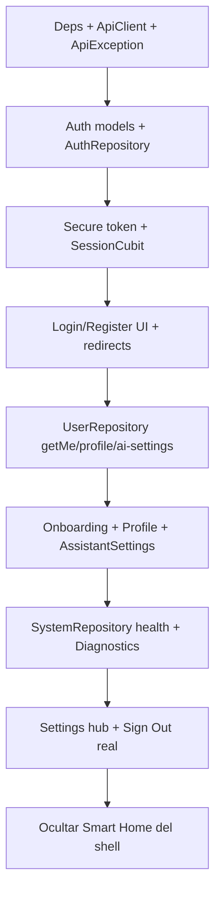

# Flutter Backend Integration Plan

Fecha: 2026-07-10  
Precondiciones: leer `docs/flutter_backend_integration_audit.md` y contratos en `docs/backend_contract/`.  
Estado: **planificación solamente** — no implementar en este documento.

## Objetivo

Integrar `sophia_ai` con Sofia Backend v0.1 reutilizando UI existente, sin activar smart home, Gemini obligatorio, FCM real ni borrado físico.

## Principios

1. **UI first, data later**: conservar `NeonWrapper` / shell; cambiar fuentes de datos detrás de Cubits.
2. **Ownership por JWT**: nunca enviar `user_id` desde Flutter.
3. **Feature flags locales**: `aiRuntime`, `actionProposalsExecute`, `notifications`, `privacyDeleteRequest`, `smartHome`.
4. **Errores normalizados**: `ApiException` → 401 logout, 403 feature off, 409 conflicto, 429 backoff.
5. **Fases del roadmap**: no saltar a chat/runtime antes de identidad + activities.

## Primera fase recomendada (implementación)

**Fase 1 ampliada mínima: Identidad + bootstrap + health + shell seguro.**

### Por qué esta primera fase

- Desbloquea todo lo demás (token, `GET /users/me`, gates de AI settings).
- Bajo riesgo visual: no exige reescribir chat ni smart home.
- Criterio de salida claro del roadmap.

### Entregables Fase 1

#### Infraestructura

| Entrega | Detalle |
| --- | --- |
| Config `base_url` | `--dart-define` o flavors; no hardcodear secretos |
| `ApiClient` | Bearer interceptor, JSON, `ApiException` |
| Secure storage | Persistir JWT; limpiar en logout/401 |
| Dependencias | `dio`, `flutter_secure_storage`, `json_annotation` + codegen |
| Feature flags | Defaults: smartHome off, aiRuntime off, FCM off, execute off |

#### Modelos (mínimo)

`ApiError`, `HealthResponse`, `AuthUser`, `LoginResponse`, `UserProfile`, `AiSettings`, `MeResponse` + enums de AI settings.

#### Repositories

`AuthRepository`, `UserRepository`, `SystemRepository` (+ stub `PrivacyRepository` solo si se incluye export).

#### Cubits / estado global

`SessionCubit` (token + user + profile + aiSettings), `AuthCubit`, `UserProfileCubit`, `AiSettingsCubit`, `OnboardingCubit`, `HealthCubit`.

#### Pantallas

| Nueva / adaptada | Origen |
| --- | --- |
| `SplashSessionScreen` | Nueva |
| `LoginScreen` / `RegisterScreen` | Nuevas |
| `OnboardingFlow` | Nueva (puede reusar `SophiaCard`) |
| `ProfileScreen` / `AssistantSettingsScreen` | Nuevas bajo Settings |
| `DiagnosticsScreen` | Adaptar `DashboardPage` → `GET /health` |
| Settings hub | Extender `SettingsPage` con navegación a profile/AI/diagnostics |

#### Navegación

```
Splash
  ├─ no token → Unauthenticated (login/register)
  ├─ token + !onboardingCompleted → Onboarding
  └─ token + onboarding ok → MainShell
        tabs v0.1: Chat (mock) | Activities (placeholder) | Settings
        Smart Home: oculto / flag
```

### Criterio de salida Fase 1

- [ ] Register + login guardan token de forma segura
- [ ] `GET /users/me` hidrata `SessionCubit`
- [ ] Profile y AI settings PATCH funcionan
- [ ] Onboarding complete marca `onboardingCompleted`
- [ ] `GET /health` visible en Diagnostics
- [ ] 401 limpia sesión y vuelve a login
- [ ] UI smart home no es tab principal
- [ ] Toggles `memory_enabled` / `reminders_enabled` / `planning_enabled` leídos en sesión (aunque features aún no existan)

### Fuera de Fase 1

Activities CRUD real, reminders API, insights, memory, AI runtime, FCM, delete-request, export (export puede ir al final de Fase 1 o inicio de alpha Firestore según roadmap).

---

## Fases siguientes (resumen operativo)

### Fase 2 — Activities y Reminders

1. Modelos `Activity` / `Reminder` + requests/list responses.
2. `ActivitiesRepository`, `RemindersRepository`.
3. Cubits list/detail/editor (+ `DueRemindersCubit` parcial).
4. Adaptar `RemindersPage` → lista de activities o reminders; añadir detail/editor.
5. Tab principal: Activities (reemplazo de Smart Home).
6. Copy: no prometer push real.

### Fase 3 — Insights y Memory

1. `InsightsRepository`, `MemoryRepository` + cubits del mapping.
2. Pantallas mood/outcomes/reflections/summary/memory.
3. Gate UI con `memory_enabled`.
4. Evitar lenguaje clínico; no reutilizar “Accuracy” como métrica médica.

### Fase 4 — AI Runtime y Proposals

1. Cablear `ChatPage` → `AiRuntimeRepository.sendMessage` con `dryRun=true`.
2. Mapear `proposed_actions` a `ActionProposalCard` generalizado.
3. Inbox approvals (`WeeklyInsightPage` o pantalla nueva).
4. Confirm/reject; `execute` solo con flag.
5. Tools solo en DeveloperTools (oculto).

### Fase 5 — Notifications y Privacy delete

1. Device tokens redactados; FCM detrás de flags.
2. `DeleteAccountRequestScreen` con copy “solicitud, no borrado inmediato”.
3. Export en Privacy.

---

## Orden de trabajo técnico sugerido (Fase 1)



### Checklist de PRs sugeridos

1. **PR-infra**: deps, `ApiClient`, config, `ApiException`, feature flags.
2. **PR-auth**: models auth/user, repos, Session/Auth cubits, login/register/splash.
3. **PR-profile**: profile + AI settings + onboarding screens.
4. **PR-diagnostics-nav**: health + remap dashboard + shell tabs + hide smart home.

---

## Cambios de navegación (detalle)

| Cambio | Motivo |
| --- | --- |
| `initialLocation` → `/splash` | Evitar entrar a chat sin sesión |
| `redirect` en GoRouter según `SessionCubit` | Auth gate |
| Tab Smart Home → Activities placeholder | Alinear MainShell al contrato |
| Rutas `/settings/profile`, `/settings/assistant`, `/settings/diagnostics` | SettingsStack |
| Mantener `/chat` mock | No romper demo hasta Fase 4 |
| Rutas huérfanas reminders/insight | Registrar en Fase 2/3 |

## Riesgos y mitigaciones (plan)

| Riesgo | Mitigación en implementación |
| --- | --- |
| Romper look & feel | No reescribir widgets core; solo data binding |
| Chat input glass no envía | En Fase 4 (o hotfix menor) unificar input con Cubit |
| Doble creación de Cubits (DI vs `BlocProvider`) | Preferir `sl<>()` + `BlocProvider.value` o factory GetIt |
| Modelos locales vs API | No reusar `TaskItem`/`SystemHealth`; crear modelos contrato |
| Scope creep smart home | Flag + no PRs de hardware en v0.1 |

## Definición de “listo para alpha local”

Según roadmap: **Fase 1 + Fase 2** con memory driver backend.

Secuencia recomendada de releases Flutter:

1. Alpha local: Fase 1 → Fase 2  
2. Alpha Firestore personal: + export  
3. Beta privada: Fase 3  
4. Beta assistant: Fase 4 dry_run  
5. Beta notifications: Fase 5 dry-run  

## Referencias

- `docs/backend_contract/flutter_endpoint_integration_contract.md`
- `docs/backend_contract/flutter_integration_roadmap.md`
- `docs/backend_contract/flutter_models_needed.md`
- `docs/backend_contract/flutter_screens_mapping.md`
- `docs/flutter_backend_integration_audit.md`
- `docs/flutter_missing_models_repositories_cubits.md`
